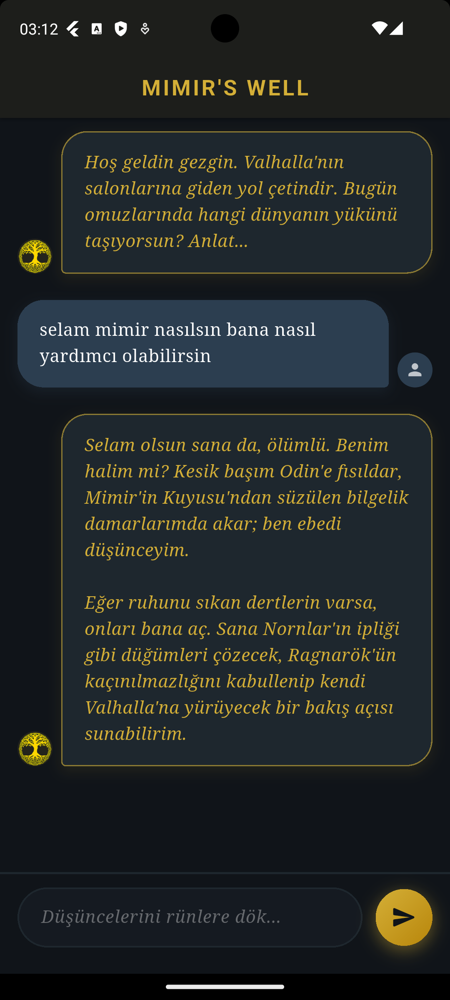

<div align="center">
  <a href="#english">En English</a> | <a href="#turkish">Tr Türkçe</a>
</div>

<span id="english"></span>

## English

# Mimir AI - AI-Powered Conversational Interface

This project is an enterprise-grade full-stack Flutter application integrating Google's Gemini AI capabilities. It embodies the persona of Mimir, the god of wisdom from Norse mythology. The development process strictly adheres to a secure architectural pattern by decoupling the AI logic and API key management from the client via a Node.js/Express middleware layer.

## Screenshots
<p align="center">
  
</p>

## Core Features
* **Persona Engineering:** Advanced system prompt configurations designed to constrain AI outputs to specific thematic domains (Stoic and Mythological responses).
* **Secure Middleware (Backend):** Node.js/Express server acting as a secure proxy, entirely isolating the Gemini API key from the frontend application.
* **Traffic Control (Rate Limiting):** Implementation of `express-rate-limit` to safeguard the API endpoints against DDoS, brute-force, and high-frequency automated requests.
* **Custom UI/UX:** Responsive, dark-mode optimized interface with localized typography, custom vector graphics (Yggdrasil), and dynamically sized text inputs.
* **Data Encoding (i18n):** Native UTF-8 parsing implementation to ensure robust handling of international and special characters in HTTP responses.

## Technologies and Dependencies
* **Framework:** Flutter & Dart
* **Backend Infrastructure:** Node.js, Express.js
* **AI Engine:** Google Gen AI SDK (`@google/genai`)
* **Security & Formatting:** `express-rate-limit`, `dotenv`, `http`

## Project Architecture and Directory Structure
The repository is structured to enhance code maintainability and isolate sensitive backend logic from the frontend client:

```text
mimir-ai-project/
│
├── backend-api/                 # Secure Node.js middleware
│   ├── index.js                 # Express server, rate limiting, and Gemini AI integration
│   ├── package.json             # Backend dependencies
│   └── .env                     # API key storage (hidden from client)
│
└── flutter_app/                 # Flutter client application
    ├── android/                 # Android-specific configurations (App name, Launcher icons)
    ├── assets/
    │   └── images/
    │       └── yggdrasil.png    # Custom avatar and launcher icon asset
    ├── lib/
    │   ├── main.dart            # Application entry point and theme configuration
    │   ├── services/
    │   │   └── api_service.dart # HTTP client handling UTF-8 decoding and backend communication
    │   └── ui/
    │       └── chat_screen.dart # Custom UI with Yggdrasil avatars and dynamic text inputs
    └── pubspec.yaml             # Flutter dependencies, launcher_icons, and asset configurations

```

## Installation and Setup

### 1. Prerequisites

* Flutter SDK (Version 3.12.2 or higher)
* Node.js (Version 18.0.0 or higher)
* Active Google Gemini API Key (Configured with API restrictions)
* Android Studio, IntelliJ IDEA, or VS Code

### 2. Repository Cloning

Execute the following commands in your terminal to clone the repository to your local environment:

```bash
git clone <repository-url>
cd <project-folder>

```

### 3. Middleware (Node.js) Setup

1. Navigate to the backend directory and install dependencies:

```bash
cd backend-api
npm install

```

2. Create a `.env` configuration file in the `backend-api` directory:

```env
GEMINI_API_KEY=YOUR_RESTRICTED_API_KEY
PORT=3000

```

3. Initialize the server:

```bash
node index.js

```

### 4. Client (Flutter) Setup

1. Open a new terminal and navigate to the frontend directory:

```bash
cd flutter_app
flutter pub get

```

2. **Development Note (Android Emulator):** The `ApiService` is pre-configured to point to `10.0.2.2` to route traffic to the host machine's localhost. For physical device testing, update the `_baseUrl` in `lib/services/api_service.dart` to the host machine's local IPv4 address.

### 5. Execution

Following the configuration, connect an emulator or a physical device and compile the application:

```bash
flutter run

```

## Developer

Burcpercin

---

## Türkçe

# Mimir AI - Yapay Zeka Destekli Sohbet Arayüzü

Bu proje, Google Gemini altyapısını kullanan kurumsal seviyede (enterprise-grade) bir full-stack Flutter uygulamasıdır. İskandinav mitolojisindeki bilgelik tanrısı Mimir'in kişiliğine bürünmüştür. Geliştirme sürecinde, yapay zeka iş mantığını ve API anahtarı yönetimini Node.js/Express ara katman (middleware) sunucusu ile istemciden (client) izole ederek güvenli bir mimari sunmaya sadık kalınmıştır.

## Ekran Görüntüleri
<p align="center">
  
</p>

## Temel Özellikler

* **Kişilik Mühendisliği (Persona Engineering):** Yapay zeka çıktılarını belirli bir tematik alanda kısıtlamak için tasarlanmış gelişmiş sistem prompt konfigürasyonları (İskandinav mitolojisi ve Stoacı felsefe).
* **Güvenli Ara Katman (Middleware):** Gemini API anahtarını ön yüz (frontend) uygulamasından tamamen soyutlayan ve güvenli proxy görevi gören Node.js/Express sunucu mimarisi.
* **Trafik Yönetimi (Rate Limiting):** API uç noktalarını DDoS, brute-force ve yüksek frekanslı otomatik isteklere karşı korumak amacıyla entegre edilmiş hız sınırı koruması.
* **Özelleştirilmiş Kullanıcı Arayüzü (UI):** Karanlık tema (dark mode) optimizasyonlu, özel vektörel grafikler içeren (Yggdrasil) ve dinamik boyutlanan metin giriş alanlarına sahip duyarlı (responsive) arayüz.
* **Veri Kodlama (i18n):** HTTP yanıtlarında uluslararası ve Türkçe özel karakterlerin kusursuz işlenmesini sağlayan yerel UTF-8 ayrıştırma (parsing) entegrasyonu.

## Kullanılan Teknolojiler ve Paketler

* **SDK:** Flutter & Dart
* **Backend:** Node.js, Express.js
* **Yapay Zeka:** Google Gen AI SDK (`@google/genai`)
* **Güvenlik & İstek Yönetimi:** `express-rate-limit`, `dotenv`, `http`

## Proje Mimarisi ve Klasör Yapısı

Proje, kodun okunabilirliğini artırmak ve hassas backend mantığını istemciden izole etmek için aşağıdaki dizin yapısına göre tasarlanmıştır:

```text
mimir-ai-project/
│
├── backend-api/                 # Güvenli Node.js ara katmanı (middleware)
│   ├── index.js                 # Express sunucusu, rate limit ve Gemini entegrasyonu
│   ├── package.json             # Backend paketleri
│   └── .env                     # API anahtarı saklama (istemciden gizli)
│
└── flutter_app/                 # Flutter istemci (client) uygulaması
    ├── android/                 # Android özel ayarları (Uygulama adı, ikonlar)
    ├── assets/
    │   └── images/
    │       └── yggdrasil.png    # Özel avatar ve uygulama ikonu (launcher icon)
    ├── lib/
    │   ├── main.dart            # Uygulama giriş noktası ve tema ayarları
    │   ├── services/
    │   │   └── api_service.dart # HTTP istekleri, UTF-8 kod çözme ve sunucu bağlantısı
    │   └── ui/
    │       └── chat_screen.dart # Yggdrasil avatarlı ve dinamik metin alanlı özel arayüz
    └── pubspec.yaml             # Flutter paketleri, ikon üretimi ve görsel yolları

```

## Kurulum Adımları

### 1. Ön Gereksinimler

* Flutter SDK (Sürüm 3.12.2 ve üzeri)
* Node.js (Sürüm 18.0.0 ve üzeri)
* Aktif bir Google Gemini API Anahtarı (API kısıtlamaları yapılandırılmış olarak)
* Android Studio, IntelliJ veya VS Code

### 2. Projeyi İndirme

Terminalinizi açın ve projeyi yerel bilgisayarınıza klonlayın:

```bash
git clone <repository-url>
cd <project-folder>

```

### 3. Sunucu Kurulumu (Backend - Node.js)

1. Backend klasörüne gidin ve bağımlılıkları yükleyin:

```bash
cd backend-api
npm install

```

2. `backend-api` klasörü içinde bir `.env` dosyası oluşturun:

```env
GEMINI_API_KEY=KISITLANMIS_API_ANAHTARINIZ
PORT=3000

```

3. Sunucuyu başlatın:

```bash
node index.js

```

### 4. Uygulama Kurulumu (Frontend - Flutter)

1. Yeni bir terminal sekmesi açın ve Flutter projesinin içine girin:

```bash
cd flutter_app
flutter pub get

```

2. **Android Emülatör Notu:** `ApiService` varsayılan olarak, ana makinenin yerel sunucusuna erişebilmek için `10.0.2.2` adresine yönlendirilmiştir. Fiziksel cihaz testleri için `lib/services/api_service.dart` dosyasındaki `_baseUrl` değerini bilgisayarınızın yerel IP adresi ile güncelleyin.

### 5. Çalıştırma

Tüm yapılandırmaları tamamladıktan sonra bir emülatör veya fiziksel cihaz bağlayarak projeyi derleyin:

```bash
flutter run

```

## Geliştirici

Burcpercin
